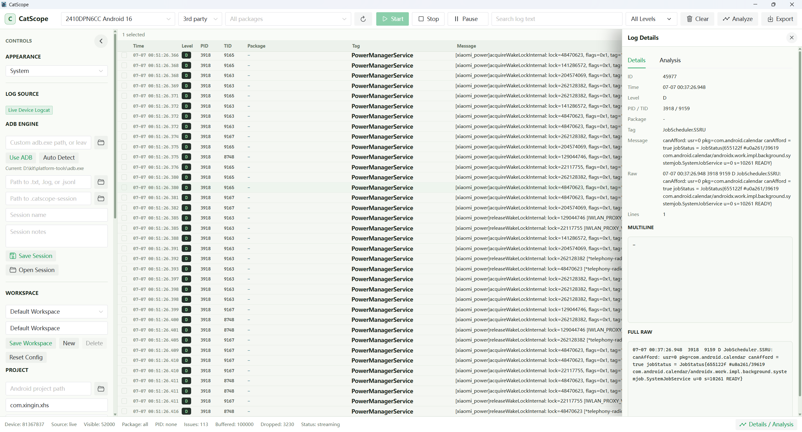
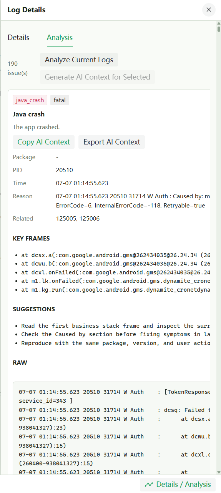
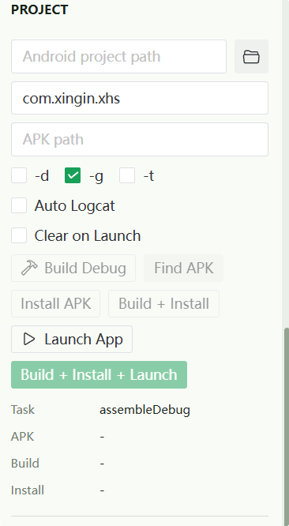

<p align="center">
  
</p>

<h1 align="center">CatScope</h1>

<p align="center">
  <strong>Android Logcat Viewer and Debugging Tool.</strong>
</p>

<p align="center">
  A lightweight Android Logcat tool for live adb logcat, offline log files, package/PID filters, Crash and ANR analysis, and local AI-ready context without opening Android Studio.
</p>

<p align="center">
  
  
</p>

<p align="center">
  English · <a href="./README.zh-CN.md">简体中文</a>
</p>

<p align="center">
  <a href="#why-catscope">Why CatScope</a> ·
  <a href="#features">Features</a> ·
  <a href="#screenshots">Screenshots</a> ·
  <a href="#quick-start">Quick Start</a> ·
  <a href="#roadmap">Roadmap</a> ·
  <a href="#documentation">Documentation</a>
</p>

CatScope is a lightweight Android Logcat viewer and desktop debugging tool. It helps Android developers inspect live `adb logcat` streams, search and filter logs by package, PID, level, tag, keyword, or regex, analyze Crash / ANR / native / JNI clues, and reopen offline log sessions without launching the full Android Studio IDE.

> Better than raw `adb logcat`, lighter than Android Studio, and more Android-aware than a generic log viewer.

CatScope is not trying to replace Android Studio. The core idea is **Logcat without Android Studio**, then carefully add the nearby workflows that make daily Android troubleshooting smoother: build, install, launch, crash analysis, export, and AI-friendly context generation.

Highlights:

- **Android Logcat Viewer / Logcat Tool** for focused Android troubleshooting.
- **Package-aware filtering** with package selection, PID tracking, level filters, tags, keywords, exclusions, and regex search.
- **Crash Analyzer** for Java crashes, ANR, native crashes, JNI errors, and install failures.
- **AI Context Generator** that creates local Markdown without calling external AI APIs.
- **Offline Log Viewer** for `.txt`, `.log`, and CatScope `.jsonl` exports.
- **Session restore** through `.catscope-session` files.

## Why CatScope

Android Studio is powerful, but it can be too heavy when the task is simply:

- watch Logcat for one device or app,
- filter logs by package, PID, level, tag, or keyword,
- inspect crash / ANR / native crash clues,
- export a focused log session,
- install and launch a debug build,
- collect context for a teammate or an AI agent.

CatScope keeps that workflow small and direct. The product boundary is intentionally narrow: it should become a great Android troubleshooting companion, not another full IDE.

## Status

CatScope is currently in **Preview**. Refer to GitHub Releases and the [changelog](./CHANGELOG.md) for the release version and checksums.

CatScope is currently in Preview / Dev status. The core Logcat Viewer, Offline Log File Viewer, rule-based Crash / ANR / Native / JNI / Install Error Analyzer, local AI Context Generator, a minimal Build / Install / Launch workflow, lightweight Workspace / Filter Presets, and Session save / restore are available.

CatScope is a lightweight Android Logcat debugging workbench. It is not an Android Studio replacement, does not provide Gradle Project Sync, and does not include a code editor. The AI Context feature only generates local Markdown; CatScope does not upload logs and does not call external AI APIs.

## Features

### Feature Checklist

- [x] Desktop app foundation
  - [x] Wails v2 desktop app with a Go backend.
  - [x] Vue 3 + TypeScript frontend.
  - [x] Startup update checks against GitHub Releases, with verified install-and-restart updates on Windows.
- [x] ADB and device management
  - [x] ADB discovery from user configuration, `ANDROID_HOME`, `ANDROID_SDK_ROOT`, and `PATH`.
  - [x] Device list parsing with clear `device`, `offline`, `unauthorized`, and `unknown` states.
  - [x] Device information display: model, brand, Android version, SDK, and ABI.
- [x] Live Logcat Viewer
  - [x] Live `adb logcat -v threadtime -b main,system,crash` streaming.
  - [x] Start, stop, restart, and device switching for Logcat streams.
  - [x] Continuous stdout / stderr reading with clear error reporting.
  - [x] 100000-line ring buffer with batch reads and dropped-line counts.
  - [x] Virtualized frontend log table.
- [x] Package and PID filtering
  - [x] Installed package listing for all packages and third-party packages.
  - [x] Package search, selection, clearing, and all-log mode.
  - [x] PID tracking for the selected package, including app restarts.
  - [x] Package / Level combined filtering and case-insensitive search.
  - [x] Search-box query syntax for `tag:`, `pid:`, `level:`, exclusions, and field matching.
- [x] Log parsing and interaction
  - [x] threadtime parsing, raw line preservation, and multiline log merging.
  - [x] Java stacktrace and AndroidRuntime `FATAL EXCEPTION` grouping.
  - [x] Pause, clear, detail / analysis panel, txt export, and jsonl export.
- [x] Offline Log File Viewer
  - [x] Open `.txt`, `.log`, and `.jsonl` log files.
  - [x] Parse ordinary threadtime Logcat text files with the existing parser.
  - [x] Preserve unparsed raw lines and multiline stacktraces.
  - [x] Reuse search, level, tag, exclude, regex, package filtering, virtual scrolling, details, Analyzer, and AI Context generation.
  - [x] Show live/offline source mode, file path, file name, entry count, and raw-line parse count.
  - [x] Reopen CatScope JSONL exports as offline logs.
- [x] Rule-based Analyzer without external AI API calls
  - [x] Java Crash: `AndroidRuntime`, `FATAL EXCEPTION`, `Process:`, `Caused by:`, and common exception types.
  - [x] Native Crash: `SIGSEGV`, `SIGABRT`, `backtrace:`, `tombstone`, `Abort message`, `fault addr`, and `libxxx.so`.
  - [x] ANR: `ANR in`, `Application Not Responding`, `Input dispatching timed out`, and service / broadcast timeouts.
  - [x] JNI Error: `JNI DETECTED ERROR IN APPLICATION`, `CheckJNI`, stale / deleted references, and pending exceptions.
  - [x] Install Error: `INSTALL_FAILED_*`, `INSTALL_PARSE_FAILED_*`, `DELETE_FAILED_*`, `Failure [INSTALL_FAILED...]`, and `adb: failed to install`.
- [x] Install Error Analyzer
  - [x] Analyze install failure text or log output.
  - [x] Provide bilingual reasons and next-step suggestions.
  - [x] Prepare analyzer output for future Build / Install / Launch workflows.
- [x] Local AI Context Generator
  - [x] Generate Markdown context for the selected analysis result.
  - [x] Include device/package/PID metadata, analysis summary, related logs, context logs, key frames, and suggestions.
  - [x] Copy the Markdown to the clipboard or export it as a `.md` file.
  - [x] Avoid OpenAI, Claude, Gemini, or any cloud model calls.
- [x] Build / Install / Launch MVP
  - [x] Select an Android project directory and detect `gradlew` / `gradlew.bat`.
  - [x] Validate `settings.gradle` / `settings.gradle.kts`.
  - [x] Run `assembleDebug` by default.
  - [x] Find the newest debug APK under `build/outputs/apk`.
  - [x] Install APKs with `adb install -r` and optional `-d`, `-g`, `-t`.
  - [x] Launch the configured package with `adb shell monkey -p <package> 1`.
  - [x] Send install failures to the Install Error Analyzer and Analysis panel.
- [x] Workspace / Filter Presets
  - [x] Store multiple lightweight workspaces in the user's local CatScope config.
  - [x] Restore project path, package name, selected device, log levels, search keyword, install options, and AI context options.
  - [x] Save, select, update, and delete workspaces.
  - [x] Built-in presets: All Logs, Errors Only, AndroidRuntime, Native Crash, Install Errors, and Current Package.
  - [x] Save, apply, rename, and delete custom filter presets with level, package, keyword, regex, tags, and exclude keyword.
- [x] Session Save / Restore
  - [x] Save live or offline debugging state as a `.catscope-session` file.
  - [x] Preserve logs, raw text, multiline stacktraces, package names, levels, tags, PID/TID, timestamps, filters, workspace metadata, AI Context options, notes, and Analysis results.
  - [x] Open a session in Session mode, restore logs into the buffer, and continue search, filtering, details inspection, Analyzer, and AI Context generation.
  - [x] Show session name, file path, log count, analysis count, and created time.
- [ ] More export formats: csv, zip.
- [ ] Module and variant selection for Build / Install / Launch.
- [x] macOS universal preview build for Intel and Apple Silicon.
- [ ] Linux support.

## Quick Start

### Requirements

- Go 1.22 or later.
- Node.js 20 or later and npm 10 or later.
- Wails v2 CLI.
- Windows with Microsoft WebView2 Runtime, or macOS for the current universal preview build.
- Android SDK Platform Tools, with `adb` available through one of:
  - `ANDROID_HOME` or `ANDROID_SDK_ROOT`.
  - `platform-tools` added to `PATH`.
  - CatScope adb path configuration, with a more complete UI planned.

Install the Wails CLI:

```powershell
go install github.com/wailsapp/wails/v2/cmd/wails@latest
```

### Run Locally

```powershell
git clone <repository-url>
cd CatScope

go test ./...

cd frontend
npm install
npm run build

cd ..
wails doctor
wails dev
```

Live Logcat requires an Android device or emulator with USB debugging authorized. Offline Log File Viewer works without an Android device and can open `.txt`, `.log`, or `.jsonl` files for search, filtering, analysis, and AI Context generation. Session mode opens `.catscope-session` files, which are CatScope debugging-state files for saving live or offline analysis work and returning to it later.

If the device is `unauthorized`, approve the authorization prompt on the device and refresh. If it is `offline`, reconnect the device or restart adb server and refresh.

### Windows Usage

For a local development build:

```powershell
scripts\check.ps1
scripts\build-windows.ps1
.\build\bin\CatScope.exe
```

For a GitHub Release build, download the Windows artifact, extract it if it is a portable archive, and run `CatScope.exe`. Live Logcat needs a device or emulator with USB debugging enabled. On the first USB connection, Android shows an authorization dialog on the device; accept it, then refresh the CatScope device list.

CatScope checks for stable updates after startup by default. Use the App Updates section in the sidebar to check manually or opt into Preview releases. On Windows, the portable EXE can download the new release, verify its SHA256 checksum, replace itself after exit, and restart. If the current directory is not writable, or on platforms that do not yet support in-app replacement, use View Release for a manual download.

### macOS Preview Usage

For a local universal preview package that runs on both Intel and Apple Silicon Macs:

```sh
scripts/build-macos.sh vX.Y.Z-preview
```

The script runs Go tests, the frontend build, `wails build -platform darwin/universal -clean -skipbindings`, creates `dist/CatScope-v<version>-macos-universal.dmg`, and writes the matching `.sha256` file. Pass the release tag explicitly, for example `scripts/build-macos.sh vX.Y.Z-preview`.

For a GitHub Release build, download the macOS DMG, open it, and drag `CatScope.app` to Applications. This preview is self-signed/ad-hoc signed and is not Apple-notarized yet, so macOS Gatekeeper may require opening it from Finder's context menu or allowing it in System Settings on first launch.

On macOS, adb is usually named `adb` instead of `adb.exe`. CatScope can discover adb from `ANDROID_HOME`, `ANDROID_SDK_ROOT`, and `PATH`, but apps launched from Finder may not inherit your shell `PATH`. If adb is not detected, set the full adb path in CatScope, for example `/Users/<you>/Library/Android/sdk/platform-tools/adb`.

### FAQ

**Is CatScope an Android Studio replacement?**
No. CatScope focuses on Logcat, crash clues, installs, launches, sessions, and local context generation. It is intentionally not a full IDE.

**Does CatScope upload my logs?**
No. Logs, sessions, workspace settings, and AI Context Markdown are local unless you manually share exported files.

**Does AI Context call OpenAI, Claude, Gemini, or another cloud model?**
No. It only creates local Markdown that you can copy or export.

**Why is my device `unauthorized`?**
The phone has not approved USB debugging for this computer. Unlock the device, accept the prompt, and refresh.

**Why is my device `offline`?**
Reconnect USB, confirm debugging is enabled, or restart adb with `adb kill-server` and refresh.

**Can CatScope sync Gradle projects or edit code?**
No. Build / Install / Launch is a basic helper workflow and does not include Gradle Project Sync or a code editor.

**Is the Vite chunk size warning a release blocker?**
No. It is currently a known build warning and does not block normal use.

## Tech Stack

```text
Desktop framework: Wails v2
Backend: Go
Frontend: Vue 3 + TypeScript
Build tool: Vite
State management: Pinia
UI library: Naive UI
Virtual scrolling: Vue virtual scrolling utilities
ADB integration: Go exec.Command
Local storage: JSON configuration, SQLite planned
Primary platform: Windows
Preview platform: macOS universal (Intel + Apple Silicon)
Planned platform: Linux
```

Vue 3 keeps the desktop-tool UI easy to evolve. Naive UI fits dark themes, forms, drawers, tabs, notifications, and workbench-style layouts. Pinia owns device, log stream, filter, and session state. Virtual scrolling keeps large Logcat sessions responsive.

## Project Scope

CatScope focuses on Android troubleshooting workflows around Logcat. The first goal is an excellent live and offline Logcat Viewer; build, install, launch, crash analysis, AI-ready context, and saved workspace presets are adjacent workflows that support the same debugging loop. The current build runner is intentionally small: it runs Gradle wrapper tasks such as the default `assembleDebug`, but it is not Gradle Project Sync and it is not a full IDE. The multi-workspace support is also lightweight configuration, not a full IDE project system.

CatScope is not intended to provide:

- code editing,
- layout preview,
- Gradle Project Sync,
- breakpoint debugging,
- profiler,
- complete signing management,
- AAB publishing,
- complex Flavor visual management,
- full NDK / CMake configuration UI,
- a full Android Studio replacement.

## Target Users

- Android app developers.
- Android plugin developers.
- Native so / JNI debugging engineers.
- QA and automation engineers.
- Developers who often debug with AI agents.
- Anyone who needs Logcat and basic app troubleshooting without opening Android Studio.

## Roadmap

1. Make the Logcat Viewer fast, filterable, searchable, and comfortable for long sessions.
2. Keep improving the rule-based Analyzer and AI context generation.
3. Expand Build / Install / Launch with module and variant selection.
4. Improve cross-platform behavior and historical log analysis.

See [docs/ROADMAP.md](./docs/ROADMAP.md) for the full roadmap.

## Repository Layout

```text
CatScope/
├─ frontend/          # Vue 3 + TypeScript frontend
├─ internal/          # Go backend packages
├─ docs/              # Architecture, roadmap and development notes
├─ docs/assets/       # README and release presentation assets
├─ docs/screenshots/  # Real screenshots when available
├─ app.go             # Wails app bindings
├─ main.go            # Application entry point
├─ wails.json         # Wails project config
├─ go.mod
├─ go.sum
├─ Logo.png
├─ README.md
└─ README.zh-CN.md
```

## Screenshots

### Live Logcat

<p align="center">
  
</p>

### Analysis and Build Workflow

| Analysis Tab | Build / Install / Launch |
| --- | --- |
|  |  |

More screenshots will be added as the preview release set is finalized. Planned coverage still includes AI Context, Offline Log, Session, and Workspace Presets.

See [docs/screenshots/README.md](./docs/screenshots/README.md) for screenshot naming and capture notes.

## Documentation

The [documentation index](./docs/README.md) groups user, development, QA, and release materials. Common entry points:

- [User Guide](./docs/USER_GUIDE.md)
- [Architecture](./docs/ARCHITECTURE.md)
- [Manual QA Checklist](./docs/QA_CHECKLIST.md)
- [Release Assets](./docs/RELEASE_ASSETS.md)
- [Changelog](./CHANGELOG.md)

## Feedback and Bug Reports

Please use the GitHub bug report template when reporting reproducible issues. A good report includes:

- OS and CatScope version.
- Android device model, Android version, and whether it is a physical device or emulator.
- `adb version` output and how adb is discovered, such as `PATH`, `ANDROID_HOME`, `ANDROID_SDK_ROOT`, or CatScope configuration.
- Clear reproduction steps, expected behavior, and actual behavior.
- Sanitized exported logs, screenshots, or recordings when they help explain the issue.

For Analyzer or AI Context issues, attach the exported AI Context Markdown if possible. AI Context is generated locally and may include package names, stack traces, device metadata, and log excerpts, so review or redact it before posting publicly.

For state restoration, filtering, workspace, or session-specific bugs, attach a sanitized `.catscope-session` file when you can. Session files are local JSON debugging-state files and may include logs, filters, Analysis results, workspace metadata, notes, and AI Context options.

## Contributing

Issues, suggestions, and pull requests are welcome. See the [contribution guide](./CONTRIBUTING.md) for local setup, checks, and PR requirements. The project is still early, so high-impact contributions include:

- Logcat Viewer stability, performance, and interaction improvements.
- adb compatibility across devices, ROMs, and emulators.
- Crash / ANR / native crash recognition rules.
- Build / Install / Launch workflows.
- Documentation, screenshots, setup notes, and cross-platform validation.

Before submitting changes, please run:

```powershell
scripts\check.ps1
```

## Privacy

CatScope reads device information and live Logcat through local adb. Offline log files are read from local disk only. Workspace and preset settings are saved as JSON in the user's local CatScope configuration directory, such as `%APPDATA%/CatScope/config.json` on Windows or the Wails app config location on macOS, and are not written into Android project directories. `.catscope-session` files are local JSON files that store a CatScope debugging state, including logs, filters, Analysis results, and AI Context options; CatScope does not upload them to the cloud. The project does not require uploading logs to a remote service. The AI Context Generator only creates local Markdown for you to copy or export; it does not call any external AI API. When sharing exported logs, session files, or AI context, avoid leaking sensitive device information, user data, tokens, package names, or internal business logs.

## License

This repository does not include a license file yet. Before public distribution or external contributions, the copyright holder must choose and add a `LICENSE`; until then, do not assume the code can be redistributed or sublicensed.
