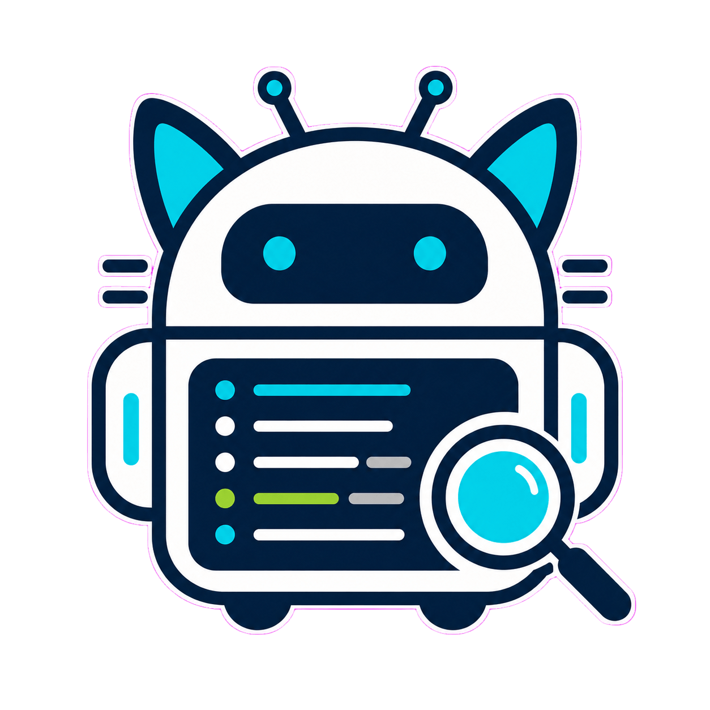

# CatScope

<p align="center">
  
</p>

<p align="center">
  <strong>Logcat without Android Studio.</strong>
</p>

<p align="center">
  一个围绕日志、崩溃、安装、启动和日常排障构建的轻量级 Android 调试工作台。
</p>

<p align="center">
  <a href="./README.md">English</a> · 简体中文
</p>

<p align="center">
  <a href="#为什么做-catscope">为什么做 CatScope</a> ·
  <a href="#功能">功能</a> ·
  <a href="#快速开始">快速开始</a> ·
  <a href="#路线图">路线图</a> ·
  <a href="#文档">文档</a>
</p>

CatScope 是一个脱离 Android Studio 的轻量级 Android Logcat 调试工作台。它面向那些只想快速查看 Android 日志、定位崩溃线索、按包名和 PID 过滤、导出关键日志、执行日常调试动作的开发者。

> 比 `adb logcat` 好用，比 Android Studio 更轻量，比普通日志查看器更懂 Android。

CatScope 不打算替代 Android Studio。它的核心思想是 **Logcat without Android Studio**，然后在这个基础上谨慎加入最贴近日常排障的能力：构建、安装、启动、崩溃分析、日志导出，以及适合 AI 辅助分析的上下文生成。

## 为什么做 CatScope

Android Studio 很强，但当任务只是下面这些时，它经常显得太重：

- 查看某台设备或某个应用的 Logcat。
- 按 package、PID、level、tag 或关键词过滤日志。
- 快速发现 crash、ANR、native crash 的关键线索。
- 导出一段聚焦后的日志会话。
- 安装并启动一个调试包。
- 给同事或 AI Agent 整理排障上下文。

CatScope 希望把这条工作流做得更小、更直接。它的产品边界也会保持克制：成为一个好用的 Android 日常排障伙伴，而不是另一个完整 IDE。

## 状态

CatScope 当前处于 MVP 阶段。核心 Logcat Viewer、规则化 Crash / ANR / Native / JNI / Install Error Analyzer、本地 AI Context Generator、最小 Build / Install / Launch 工作流，以及轻量 Workspace / Filter Presets 已可用。

## 功能

### 功能清单

- [x] 桌面应用基础
  - [x] Wails v2 桌面应用，Go 后端。
  - [x] Vue 3 + TypeScript 前端。
- [x] ADB 与设备管理
  - [x] ADB 自动查找，支持用户配置、`ANDROID_HOME`、`ANDROID_SDK_ROOT` 和 `PATH`。
  - [x] 设备列表解析，区分 `device`、`offline`、`unauthorized` 和 `unknown`。
  - [x] 设备信息读取，包括 model、brand、Android version、SDK 和 ABI。
- [x] 实时 Logcat Viewer
  - [x] 实时读取 `adb logcat -v threadtime -b main,system,crash`。
  - [x] Logcat 启动、停止、重启和设备切换。
  - [x] stdout / stderr 持续读取，异常退出时显示明确错误。
  - [x] 100000 行 ring buffer，支持批量拉取和丢弃计数。
  - [x] 前端虚拟滚动日志表。
- [x] Package 与 PID 过滤
  - [x] 已安装包列表读取，支持全部包和第三方包。
  - [x] Package 搜索、选择、清空，以及全部日志模式。
  - [x] PID 自动追踪，应用重启后自动更新当前 PID。
  - [x] Package / Level 组合过滤，大小写不敏感搜索。
- [x] 日志解析与交互
  - [x] threadtime 解析、raw 保留、多行日志归并。
  - [x] Java stacktrace 和 AndroidRuntime `FATAL EXCEPTION` 基础归并。
  - [x] 暂停、清屏、日志详情 / Analysis 面板和 txt 导出。
- [x] 规则化 Analyzer，不调用外部 AI API
  - [x] Java Crash: `AndroidRuntime`、`FATAL EXCEPTION`、`Process:`、`Caused by:` 和常见异常类型。
  - [x] Native Crash: `SIGSEGV`、`SIGABRT`、`backtrace:`、`tombstone`、`Abort message`、`fault addr` 和 `libxxx.so`。
  - [x] ANR: `ANR in`、`Application Not Responding`、`Input dispatching timed out` 和 service / broadcast timeout。
  - [x] JNI Error: `JNI DETECTED ERROR IN APPLICATION`、`CheckJNI`、stale / deleted reference 和 pending exception。
  - [x] Install Error: `INSTALL_FAILED_*`、`INSTALL_PARSE_FAILED_*`、`DELETE_FAILED_*`、`Failure [INSTALL_FAILED...]` 和 `adb: failed to install`。
- [x] Install Error Analyzer
  - [x] 分析安装失败文本或日志输出。
  - [x] 给出中英文原因和下一步建议。
  - [x] 为后续 Build / Install / Launch 工作流复用分析能力。
- [x] 本地 AI Context Generator
  - [x] 为选中的分析结果生成 Markdown 上下文。
  - [x] 包含设备、package、PID、分析摘要、关联日志、上下文日志、关键帧和建议。
  - [x] 支持复制到剪贴板或导出为 `.md` 文件。
  - [x] 不调用 OpenAI、Claude、Gemini 或任何云端模型。
- [x] Build / Install / Launch MVP
  - [x] 选择 Android 项目目录并检测 `gradlew` / `gradlew.bat`。
  - [x] 校验 `settings.gradle` / `settings.gradle.kts`。
  - [x] 默认执行 `assembleDebug`。
  - [x] 在 `build/outputs/apk` 下查找最新 debug APK。
  - [x] 使用 `adb install -r` 安装 APK，并支持可选 `-d`、`-g`、`-t`。
  - [x] 使用 `adb shell monkey -p <package> 1` 启动配置的 package。
  - [x] 安装失败接入 Install Error Analyzer 和 Analysis 面板。
- [x] Workspace / Filter Presets
  - [x] 在用户本地 CatScope 配置中保存多个轻量 workspace。
  - [x] 恢复 project path、package name、已选设备、日志 level、搜索词、安装选项和 AI context options。
  - [x] 支持保存、选择、更新和删除 workspace。
  - [x] 内置 All Logs、Errors Only、AndroidRuntime、Native Crash、Install Errors 和 Current Package 预设。
  - [x] 支持保存、应用、重命名和删除自定义过滤预设，包含 level、package、keyword、regex、tags 和 exclude keyword。
- [ ] 离线打开历史日志。
- [ ] 更多导出格式: jsonl、csv、zip。
- [ ] Build / Install / Launch 的 module 和 variant 选择。
- [ ] macOS 和 Linux 适配。

## 快速开始

### 环境要求

- Go 1.22 或更新版本。
- Node.js 20 或更新版本，npm 10 或更新版本。
- Wails v2 CLI。
- Microsoft WebView2 Runtime。
- Android SDK Platform Tools，并确保 `adb` 可通过以下任一方式找到：
  - 配置 `ANDROID_HOME` 或 `ANDROID_SDK_ROOT`。
  - 将 `platform-tools` 加入 `PATH`。
  - 在 CatScope 中配置 adb 路径，后续版本会补充更完整的 UI 配置。

安装 Wails CLI：

```powershell
go install github.com/wailsapp/wails/v2/cmd/wails@latest
```

### 本地运行

```powershell
git clone <repository-url>
cd CatScope

go test ./...

cd frontend
npm install
npm run build

cd ..
wails doctor
wails dev
```

实时 Logcat 需要连接 Android 真机或模拟器，并在设备上允许 USB 调试授权。

如果设备显示 `unauthorized`，请在设备弹窗中允许授权后刷新设备。如果设备显示 `offline`，请重新连接设备或重启 adb server 后刷新。

## 技术栈

```text
桌面框架: Wails v2
后端: Go
前端: Vue 3 + TypeScript
构建工具: Vite
状态管理: Pinia
UI 组件库: Naive UI
虚拟滚动: Vue virtual scrolling utilities
ADB 集成: Go exec.Command
本地存储: JSON 配置文件，SQLite planned
优先平台: Windows
计划平台: macOS, Linux
```

前端选择 Vue 3 是为了降低工具型桌面应用的 UI 开发复杂度。Naive UI 适合暗色主题、表单、弹窗、抽屉、标签页、通知和桌面工具风格；Pinia 负责设备、日志流、过滤器和会话状态；虚拟滚动负责大量 Logcat 行渲染。

## 项目边界

CatScope 聚焦 Logcat 周边的 Android 日常排障工作流。第一目标是做好 Logcat Viewer；构建、安装、启动、崩溃分析、AI 上下文和保存的 workspace preset 是服务同一条调试链路的相邻能力。当前 build runner 刻意保持轻量：它会执行默认 `assembleDebug` 等 Gradle wrapper 任务，但不是 Gradle Project Sync，也不是完整 IDE。当前多 workspace 也是轻量配置，不是完整 IDE 项目系统。

CatScope 暂不提供：

- 代码编辑器。
- 布局预览。
- Gradle Project Sync。
- 断点调试。
- Profiler。
- 完整签名管理。
- AAB 发布。
- 复杂 Flavor 可视化管理。
- 完整 NDK / CMake 配置 UI。
- 替代 Android Studio 的完整 IDE 能力。

## 目标用户

- Android 应用开发者。
- Android 插件开发者。
- Native so / JNI 调试人员。
- 自动化测试与调试人员。
- 经常使用 AI Agent 辅助开发的工程师。
- 只需要 Logcat 和基础安装调试能力、不想打开完整 Android Studio 的用户。

## 路线图

1. 做好高性能、可过滤、可搜索、适合长时间排障的 Logcat Viewer。
2. 继续增强规则化 Analyzer 和 AI 上下文生成。
3. 继续增强 Build / Install / Launch，补充 module 和 variant 选择。
4. 逐步完善跨平台体验和历史日志分析。

完整路线图见 [docs/ROADMAP.md](./docs/ROADMAP.md)。

## 仓库结构

```text
CatScope/
├─ frontend/          # Vue 3 + TypeScript frontend
├─ internal/          # Go backend packages
├─ docs/              # Architecture, roadmap and development notes
├─ app.go             # Wails app bindings
├─ main.go            # Application entry point
├─ wails.json         # Wails project config
├─ go.mod
├─ go.sum
├─ Logo.png
├─ README.md
└─ README.zh-CN.md
```

## 文档

- [Roadmap](./docs/ROADMAP.md)
- [Architecture](./docs/ARCHITECTURE.md)
- [MVP Tasks](./docs/MVP_TASKS.md)
- [Codex Start Prompt](./docs/CODEX_START_PROMPT.md)

## 贡献

欢迎提交 issue、建议和 pull request。当前项目仍处于早期阶段，高价值贡献方向包括：

- Logcat Viewer 的稳定性、性能和交互体验。
- 不同 Android 设备、ROM、模拟器上的 adb 兼容性。
- Crash / ANR / Native crash 识别规则。
- Build / Install / Launch 工作流。
- 文档、截图、安装说明和跨平台验证。

提交改动前建议运行：

```powershell
go test ./...

cd frontend
npm install
npm run build
```

## 隐私

CatScope 通过本机 adb 读取设备信息和 Logcat。Workspace 和 preset 设置会以 JSON 保存在用户本地 CatScope 配置目录中，例如 Windows 下的 `%APPDATA%/CatScope/config.json`，不会写入 Android 项目目录。项目本身不要求上传日志到远程服务。AI Context Generator 只在本地生成适合复制或导出的 Markdown，不调用任何外部 AI API。分享导出的日志或 AI Context 时，请注意不要公开敏感设备信息、用户数据、token、包名或内部业务日志。

## 许可证

本仓库尚未包含许可证文件。正式对外分发或接受外部贡献前，建议补充 `LICENSE` 并在本节声明许可证类型。
